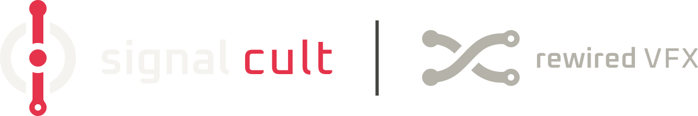

# rewired-vfx SIGNAL CULT

Free video effects for DaVinci Resolve, with local browser tools and Windows OpenFX plugins.

**Free to use, including for paid video and VFX work.** Original code is licensed
under **BSD-3-Clause with Commons Clause 1.0**; see the complete [license](LICENSE).
Redistributions must retain the copyright notice, BSD terms and Commons Clause.
You may not sell products or services whose value derives entirely or substantially
from this software without separate permission. This protects against simply
rebranding and reselling the plugins; it does not prohibit every use in a larger
commercial product with substantial independent value. Rendered videos do not
require a SIGNAL CULT credit merely because the tools were used.

The combination is source-available, not OSI-approved open source.
See the [Commons Clause explanation](https://commonsclause.com/) and
[third-party notices](THIRD_PARTY_NOTICES.md). Third-party components retain
their own licenses.

Canonical repository: [rewired/signal-cult](https://github.com/rewired/signal-cult).
The collection is maintained here; the former standalone repositories are no longer required.

The collection currently contains four Windows OpenFX plug-ins and two
browser-only effect studies.

### Resolve plug-ins

- **[BROKEN FM](plugins/broken-fm/README.md)** — PM/FM video-signal destruction,
  CUDA OFX, browser editor and Companion.
- **[CRT SIM](plugins/crt-sim/README.md)** — CRT and Pixel / Sci-Fi processing,
  CUDA/CPU OFX, browser editor and Companion.
- **[GRID ROT](plugins/grid-rot/README.md)** — deterministic spatial and temporal
  cell damage, CUDA/CPU OFX, browser editor and Companion with preset previews.
- **[RASTER RUPTURE](plugins/raster-rupture/README.md)** — directional raster
  tears, float-mask routing and temporal feedback, CUDA/CPU OFX and browser
  editor. It currently has no Companion.

All four use the `com.rewired-vfx.<plugin>` identifier family and the shared
compact SIGNAL CULT shell.

### Browser studies

- **[SIGNAL ROT](plugins/signal-rot/README.md)** — motion-driven WebGL 2 feedback.
- **[BUCKET ROT](plugins/bucket-rot/README.md)** — a 64-stage delay and modulation
  matrix.

## Repository structure

```text
plugins/
  broken-fm/       # Browser editor, CUDA OFX, Companion, presets, tests and manual
  crt-sim/         # Browser editor, CUDA/CPU OFX, Companion, presets and tests
  signal-rot/      # Browser-only motion-feedback study
  bucket-rot/      # Browser-only 64-stage delay matrix
  grid-rot/        # Browser editor, CUDA/CPU OFX, Companion, presets and tests
  raster-rupture/  # Browser editor, CUDA/CPU OFX, presets and tests
scripts/
  build-native.ps1 # Build and test one or all native plugins
  test.ps1         # Run all plugin JavaScript regression suites
  start-tools.ps1  # Start all local web tools
docs/             # Collection architecture and integration notes
CMakeLists.txt     # Shared native build entry
dist/             # Ignored collection build artifacts and local dependencies
```

Each native plugin owns its `CMakeLists.txt`, `README.md`, native renderer, OFX
adapter, presets, tests and build/install scripts. Internal layouts remain
plugin-specific; shared code is limited to genuinely common collection assets.
See [repository conventions](docs/repository-structure.md) and the
[CRT integration guide](docs/crt-sim-integration.md).

## Native build

Windows x64 prerequisites: Visual Studio 2022 C++ tools, CMake >=3.24,
Node.js >=22.13.0, and CUDA 12.8 for GPU builds. From this directory:

```powershell
./scripts/build-native.ps1                    # all four native plugins
./scripts/build-native.ps1 -Plugin broken-fm
./scripts/build-native.ps1 -Plugin crt-sim
./scripts/build-native.ps1 -Plugin crt-sim -CpuOnly
./scripts/build-native.ps1 -Plugin grid-rot
./scripts/build-native.ps1 -Plugin grid-rot -CpuOnly
./scripts/build-native.ps1 -Plugin raster-rupture
./scripts/build-native.ps1 -Plugin raster-rupture -CpuOnly
```

Each command builds and runs the selected native tests. Output is
`dist/build/windows-x64-<selection>/bundle/`; CPU-only builds append `-cpu` to
the selection name.
Use `-OpenFxRoot <sdk>` and `-NlohmannJsonRoot <json>` to provide existing
OpenFX and nlohmann/json checkouts where supported; otherwise pinned dependency
downloads apply.
The script uses `CUDA_PATH` as the CUDA toolset location when set.

These outputs are native bundles, not a collection installer. Packaging and
per-user installation remain plugin-specific. BROKEN FM, CRT SIM and GRID ROT
also package their Companions; RASTER RUPTURE currently installs only its OFX
bundle. See each plugin's README and `scripts/` directory for exact commands.

## Start all tools

Run `start.bat` in the repository root and open the [plugin menu](http://localhost:8080/).
One local Python server serves the menu and every tool:

- [BROKEN FM](http://localhost:8080/broken-fm/)
- [CRT SIM](http://localhost:8080/crt-sim/)
- [SIGNAL ROT preview](http://localhost:8080/signal-rot/)
- [BUCKET ROT preview](http://localhost:8080/bucket-rot/)
- [GRID ROT preview](http://localhost:8080/grid-rot/)
- [RASTER RUPTURE preview](http://localhost:8080/raster-rupture/)

All tools can be open at the same time. Stop the server with Ctrl+C. The plugin-local
`start.bat` shortcuts also start the whole collection. Any future tool with an
`index.html` under `plugins/<name>/` is automatically available at `/<name>/`.

No npm install or frontend build is required. From PowerShell:

```powershell
./scripts/start-tools.ps1
./scripts/test.ps1
```

Tests and native/Companion builds use Node.js. The four native products share the
compact SIGNAL CULT application shell and rewired-vfx website design tokens.
A combined collection installer remains future release work.
