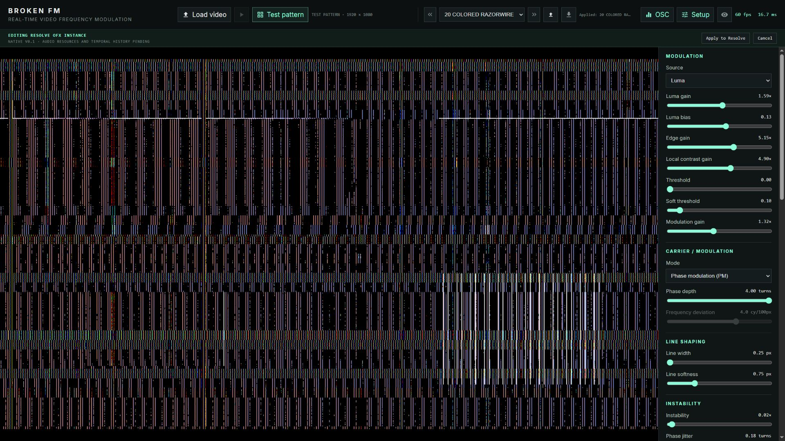
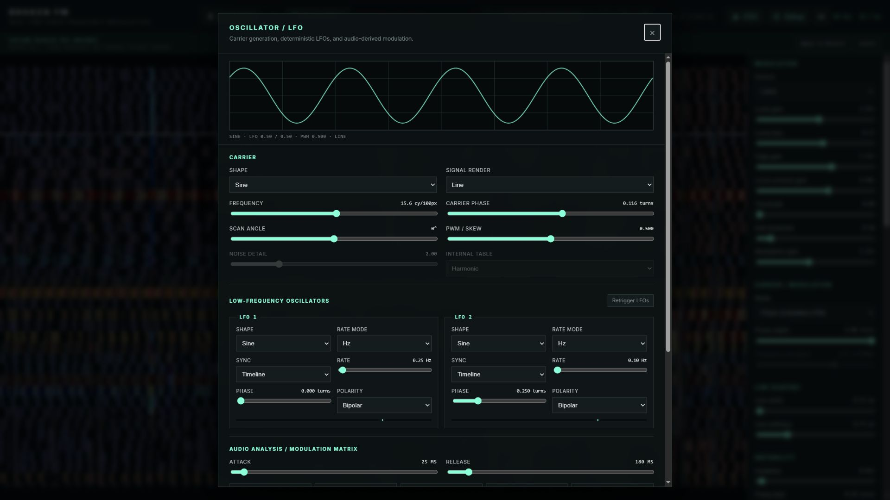
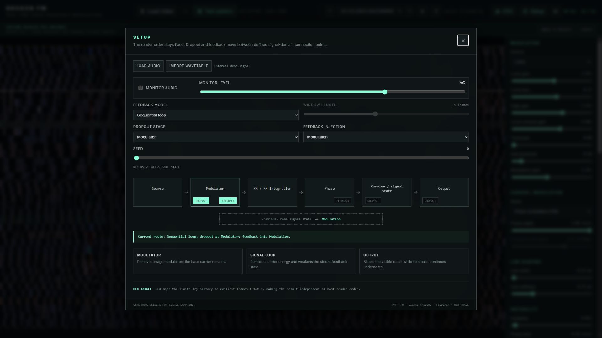
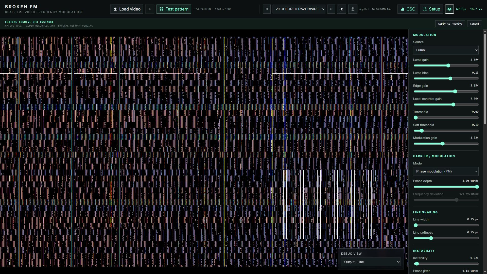

# BROKEN FM User Manual

**Version 0.1.0 | UI language: English | Preset schema: 16 | Parameter contract: 1**

BROKEN FM turns image structure into a generated electronic signal. It is not a displacement, crop, or scaling effect: source pixels are analyzed as modulation while the carrier is built in output pixel space. This manual describes the English Companion UI and the matching version-1 parameter contract for BROKEN FM 0.1.0.

> Native OFX v0.1 capability note: PM/FM, procedural carriers, LFO routing, instability, dropout, color, and output shaping run natively. Audio carrier/analysis, imported custom wavetable payloads, feedback history, and phosphor history remain parity gates. The Companion session disables unsupported choices where possible; shared Resolve enum and matrix controls may still expose combinations that the native renderer rejects instead of approximating.

## Photosensitivity warning

BROKEN FM can generate flashing, flickering, and high-contrast moving patterns. A photosensitivity warning appears before the renderer or test pattern starts. Select its checkbox to suppress future warnings on the same device; clear the application's local storage to show it again.

## Interface tour

*Main interface at 1920 x 1080, using 20 COLORED RAZORWIRE.*

*OSC/LFO modal with carrier preview, two LFOs, and the modulation matrix.*

*Setup modal showing the active dropout and feedback connection points.*

*Optional lower-right Debug View overlay; it never replaces the main result.*

## Quick start

1. **Start from a preset.** Choose a factory preset in the header and step through the library with the previous/next buttons. Presets are complete effect states and are the fastest way to learn the available range.

2. **Choose the source.** After the safety warning is acknowledged, Test pattern is active and highlighted by default. Loading a video enables Play. Selecting Test pattern pauses the loaded video; pressing Play resumes the video and makes it the source.

3. **Shape the modulation.** Choose Mod Source, then balance its gain/bias and optional threshold. Set Modulation Gain to 0 whenever you want to inspect the dry carrier.

4. **Choose PM or FM.** PM is local and immediate. FM accumulates change along Scan Angle and is usually more folded, torn, and direction-dependent.

5. **Add motion deliberately.** Use Instability for signal failure, or open OSC to route deterministic LFO/audio sources to explicit destinations. A changing destination shows base value -> effective value.

6. **Save or apply.** Save JSON writes effect parameters only. In a Resolve OFX editing session, Apply to Resolve returns the current settings; Cancel leaves the plugin instance unchanged.

## Header and session controls

- **Load video** opens a local video. BROKEN FM preserves its render dimensions; the UI does not crop or scale the source.
- **Play/Pause** controls a loaded video and shared audio playhead. It is disabled until video is loaded.
- **Test pattern** selects the built-in 1920 x 1080 pattern and pauses loaded video. The highlighted button always identifies the active source.
- **Preset previous/current/next** steps through 56 factory presets. **Load JSON** and **Save JSON** exchange schema-16 preset files.
- **OSC** opens carrier, LFO, audio-analysis, and four-slot modulation controls.
- **Setup** opens audio/wavetable session assets, monitor controls, deterministic Seed, and the signal-routing diagram.
- **Debug View** toggles the translucent diagnostic selector over the lower-right of the preview. It defaults to off.
- **Apply to Resolve/Cancel** are shown during an OFX Companion session. Apply validates and returns the preset; Cancel makes no changes.

## Reading and adjusting controls

Normal dragging uses the fine slider step. Hold **Ctrl while dragging** for meaningful coarse snapping (for example 15-degree angles, whole carrier cycles, and quarter-turn depth). A gray control is inactive because another choice makes it irrelevant. Matrix-modulated values display **base -> effective** while the effective value differs.

## Complete parameter reference

### Modulation source

| Parameter | Values | Default | What it does |
|---|---|---:|---|
| **Mod Source** (`modSource`) | luma, inverted-luma, edges, local-contrast, luma-edges | luma | Chooses the image feature that drives modulation: luminance, inverted luminance, edges, local contrast, or a luminance-plus-edge blend. |
| **Luma Gain** (`lumaGain`) | 0 to 3 | 1 | Multiplies source luminance before centering it around the neutral midpoint. Higher values make tonal differences drive the carrier more strongly. |
| **Luma Bias** (`lumaBias`) | -1 to 1 | 0 | Offsets luminance before it becomes a modulation signal. Use it to choose which tonal region sits near the neutral carrier state. |
| **Edge Gain** (`edgeGain`) | 0 to 8 | 2.5 | Sets the strength of the extracted edge signal. It is most obvious with Edges or Luma + edges as Mod Source. |
| **Local Contrast Gain** (`localContrastGain`) | 0 to 8 | 4 | Sets the strength of local brightness differences. Higher values emphasize texture and small regional changes rather than overall exposure. |
| **Mod Threshold** (`modThreshold`) | 0 to 1 | 0 | Suppresses modulation below the selected level. A value of 0 is an exact bypass; higher values isolate progressively stronger source features. |
| **Mod Softness** (`modSoftness`) | 0 to 1 | 0.1 | Controls the transition width around Mod Threshold. At 0 the threshold is hard; higher values create a smoother gate. It has no visible effect when Threshold is 0. |
| **Modulation Gain** (`modulationGain`) | 0 to 3 | 1 | Master gain for the conditioned image modulation before PM or FM. At 0 the source contributes no information to the generated signal. |

### Carrier and PM/FM

| Parameter | Values | Default | What it does |
|---|---|---:|---|
| **Mode** (`mode`) | pm, fm | pm | Selects the signal model. PM adds the source value directly to carrier phase. FM integrates source-driven frequency changes along the selected scan direction, producing folds and accumulated bends. |
| **Frequency** (`frequency`) | 0.5 to 30 cy/100px | 8 cy/100px | Base carrier density in cycles per 100 output pixels along Scan Angle. Higher values create more closely spaced lines or waveform cycles. |
| **Carrier Phase** (`carrierPhase`) | -1 to 1 turns | 0 turns | Offsets the carrier by whole turns without moving source pixels. Animate it to make the generated signal travel through the image. |
| **Carrier Shape** (`carrierShape`) | sine, triangle, saw, square, noise, wavetable, audio | sine | Selects Sine, Triangle, Saw, Square, Noise, Wavetable, or Audio as the carrier. Audio requires a loaded audio source in the Companion preview. |
| **Signal Render** (`signalRender`) | line, waveform | line | Line draws narrow contours at repeating carrier phases. Waveform displays the continuous bipolar signal as image intensity. |
| **Pwm** (`pwm`) | 0.05 to 0.95 | 0.5 | Changes duty cycle for Square and skew/symmetry for Triangle and Saw-derived shapes. 0.5 is centered and symmetrical. |
| **Noise Detail** (`noiseDetail`) | 0.25 to 8 | 2 | Controls spatial detail for the Noise carrier. Low values make broad variations; high values make finer, faster-changing structure. |
| **Wavetable** (`wavetable`) | harmonic, folded, formant, custom | harmonic | Selects the internal Harmonic, Folded, or Formant table, or the session-only imported Custom table. Custom data is not embedded in preset JSON. |
| **Phase Depth** (`phaseDepth`) | 0 to 4 turns | 0.8 turns | PM depth in full turns. It controls how far image modulation bends carrier phase; 0 removes PM influence even if Modulation Gain is non-zero. |
| **Frequency Deviation** (`frequencyDeviation`) | -12 to 12 cy/100px | 4 cy/100px | FM deviation in cycles per 100 pixels at full-scale modulation. Positive and negative values reverse the direction of accumulated frequency bending. Active only in FM mode. |
| **Scan Angle** (`scanAngle`) | -180 to 180 degrees | 0 degrees | Direction in which the carrier and FM integral travel, from -180 degrees to 180 degrees. It rotates the signal coordinate, not the source image. |

### Line shaping

| Parameter | Values | Default | What it does |
|---|---|---:|---|
| **Line Width** (`lineWidth`) | 0.25 to 5 px | 1.2 px | Approximate on-screen thickness of Line render contours in pixels. |
| **Line Softness** (`lineSoftness`) | 0 to 3 px | 0.75 px | Antialiasing and edge softness around Line render contours. 0 is crisp; larger values create broader, softer edges. |

### Instability

| Parameter | Values | Default | What it does |
|---|---|---:|---|
| **Instability** (`instability`) | 0 to 1 | 0 | Master amount for drift and jitter contributions. At 0 the clean PM/FM path is restored even when the individual instability controls have non-zero setup values. |
| **Phase Jitter** (`phaseJitter`) | 0 to 1 turns | 0.18 turns | Adds smooth, deterministic disturbance directly to carrier phase. It roughens and wriggles the signal without adding a visible noise overlay. |
| **Signal Noise** (`signalNoise`) | 0 to 1 | 0 | Injects deterministic broadband disturbance into signal phase. It produces RF-like breakup while remaining part of the carrier calculation. |
| **Frequency Drift** (`frequencyDrift`) | 0 to 8 cy/100px | 1.5 cy/100px | Maximum slow variation of carrier frequency in cycles per 100 pixels. Its motion rate is controlled by Drift Rate. |
| **Horizontal Drift** (`horizontalDrift`) | 0 to 120 px | 0 px | Moves generated signal coordinates horizontally in pixel space. The source image is not resampled or translated. |
| **Vertical Drift** (`verticalDrift`) | 0 to 120 px | 0 px | Moves generated signal coordinates vertically in pixel space. Combine it with Horizontal Drift for wandering two-axis motion. |
| **Drift Rate** (`driftRate`) | 0.01 to 5 Hz | 0.22 Hz | Speed in hertz of frequency and coordinate drift fields. Low values wander slowly; high values hunt rapidly. |
| **Time Jitter** (`timeJitter`) | 0 to 30 frames | 0 frames | Perturbs the internal signal clock by an amount expressed in frames. It affects procedural motion and failure timing, but does not select a different source-video frame. |
| **Line Jitter** (`lineJitter`) | 0 to 40 px | 5 px | Maximum displacement of scan-line bands in pixels. This is the amplitude of horizontal-sync-like line movement. |
| **Line Jitter Scale** (`lineJitterScale`) | 1 to 128 px | 2 px | Width of the bands affected by Line Jitter. Small values produce fine buzzing lines; large values shift broader blocks together. |
| **Line Jitter Speed** (`lineJitterSpeed`) | 0 to 30 Hz | 7 Hz | Temporal speed in hertz of the Line Jitter pattern. 0 freezes the pattern for a given frame state. |

### Signal failure

| Parameter | Values | Default | What it does |
|---|---|---:|---|
| **Dropout** (`dropout`) | 0 to 1 | 0 | Probability/intensity of deterministic missing-signal bands. The affected signal-domain location is selected by Dropout Stage. |
| **Dropout Angle** (`dropoutAngle`) | -180 to 180 degrees | 0 degrees | Orientation of dropout bands, independent of Scan Angle. Use a different angle to cross-cut the carrier structure. |
| **Line Tear** (`lineTear`) | 0 to 120 px | 0 px | Maximum discontinuous jump of the scan coordinate in pixels. It tears carrier phase and FM lookup together instead of shifting the finished image. |
| **Dropout Stage** (`dropoutStage`) | modulator, signal-loop, output | modulator | Chooses where dropout enters the route: Modulator removes source modulation, Signal loop removes carrier energy and weakens stored feedback, and Output blacks only the visible result. |

### Feedback

| Parameter | Values | Default | What it does |
|---|---|---:|---|
| **Feedback Amount** (`feedbackAmount`) | 0 to 1 | 0 | Coupling strength of the stored signal returned to the current frame. 0 disables feedback. |
| **Feedback Decay** (`feedbackDecay`) | 0 to 0.99 | 0.9 | Retention applied to older signal state. Values near 1 create longer, more persistent echoes. |
| **Feedback Displacement** (`feedbackDisplacement`) | 0 to 64 px/frame | 0 px/frame | Moves stored signal by pixels per age step before reinjection. It creates trails, conveyors, and drifting memory rather than a simple overlay. |
| **Feedback Displacement Angle** (`feedbackDisplacementAngle`) | -180 to 180 degrees | 0 degrees | Direction of feedback displacement from -180 degrees to 180 degrees. |
| **Feedback Phase** (`feedbackPhase`) | -1 to 1 turns | 0 turns | Rotates the stored waveform and quadrature pair in turns before reinjection. This changes echo phase and polarity without disguising the operation as gain. |
| **Feedback Injection** (`feedbackInjection`) | phase, modulation | phase | Phase injects stored state after PM/FM integration. Modulation returns it before integration, so FM can accumulate and reshape the feedback. |
| **Feedback Model** (`feedbackModel`) | sequential, finite | sequential | Sequential loop recursively uses the previous wet state and depends on linear playback. Finite window combines a bounded set of previous dry frames for a deterministic history length. |
| **Feedback Window** (`feedbackWindow`) | 1 to 8 | 4 | Number of previous dry frames, 1 through 8, used by Finite window. It is disabled for Sequential loop. |

### Color

| Parameter | Values | Default | What it does |
|---|---|---:|---|
| **Color Mode** (`colorMode`) | mono, input-color, rgb-phase | mono | Mono outputs one signal in all channels. Input color applies normalized source chroma to signal energy. RGB phase evaluates red, green, and blue at different carrier phases. |
| **Rgb Phase Offset** (`rgbPhaseOffset`) | 0 to 0.5 turns | 0.035 turns | Phase separation in turns between RGB channels. Active only in RGB phase mode; larger offsets create stronger color splitting. |

### Output

| Parameter | Values | Default | What it does |
|---|---|---:|---|
| **Black Level** (`blackLevel`) | -0.5 to 0.5 | 0 | Adds or removes output pedestal before contrast, gamma, and brightness shaping. Negative values crush low signal; positive values lift black. |
| **Signal Gamma** (`signalGamma`) | 0.25 to 4 | 1 | Nonlinear response of the generated signal. Values below 1 brighten mid-levels; values above 1 darken them. |
| **Brightness** (`brightness`) | 0 to 3 | 1 | Final output gain after black level, contrast, and gamma. At 0 the visible output is black. |
| **Contrast** (`contrast`) | 0.25 to 4 | 1 | Expands or compresses output around mid-gray before gamma. 1 is neutral. |
| **Phosphor Persistence** (`phosphorPersistence`) | 0 to 3000 ms | 0 ms | Peak-hold afterglow half-life in milliseconds. It stores bright RGB emission while decaying older light; it never feeds back into the carrier or modulation path. |

### Audio analysis

| Parameter | Values | Default | What it does |
|---|---|---:|---|
| **Audio Attack** (`audioAttack`) | 0 to 500 ms | 25 ms | Rise time in milliseconds for Level, Low, Mid, High, and Transient analysis. Short attack follows hits quickly; long attack smooths their onset. |
| **Audio Release** (`audioRelease`) | 0 to 2000 ms | 180 ms | Fall time in milliseconds for audio analysis. Long release holds energy after a sound; short release makes modulation drop quickly. |

### Low-frequency oscillators

| Parameter | Values | Default | What it does |
|---|---|---:|---|
| **Lfo1 Shape** (`lfo1Shape`) | sine, triangle, saw, square, sample-hold, smooth-noise | sine | Waveform generated by LFO 1: Sine, Triangle, Saw, Square, stepped Sample & hold, or interpolated Smooth noise. |
| **Lfo1 Rate Mode** (`lfo1RateMode`) | hz, bpm | hz | Chooses free-running Hz or tempo-based BPM timing for LFO 1. Only the controls for the selected rate mode affect its speed. |
| **Lfo1 Sync** (`lfo1Sync`) | timeline, transport | timeline | Timeline evaluates LFO 1 from absolute host time. Transport subtracts the most recent retrigger origin so playback/retrigger can restart its cycle. |
| **Lfo1 Rate Hz** (`lfo1RateHz`) | 0.01 to 20 Hz | 0.25 Hz | Free-running speed of LFO 1 in cycles per second. Active when Rate mode is Hz. |
| **Lfo1 Bpm** (`lfo1Bpm`) | 20 to 300 BPM | 120 BPM | Tempo used by LFO 1 for musical timing. Active when Rate mode is BPM. |
| **Lfo1 Division** (`lfo1Division`) | 2-bars, 1-bar, 1-2, 1-4, 1-8, 1-16, 1-32 | 2-bars | Musical cycle length for LFO 1, from two bars to 1/32. In 4/4, 1/4 produces one cycle per beat. |
| **Lfo1 Phase** (`lfo1Phase`) | 0 to 1 turns | 0 turns | Starting phase of LFO 1 in turns. 0.25 is a quarter-cycle offset and 0.5 is half a cycle. |
| **Lfo1 Polarity** (`lfo1Polarity`) | bipolar, unipolar | bipolar | Bipolar maps LFO 1 to -1...+1 for motion around the base value. Unipolar maps it to 0...+1 for one-direction modulation. |
| **Lfo2 Shape** (`lfo2Shape`) | sine, triangle, saw, square, sample-hold, smooth-noise | sine | Waveform generated by LFO 2: Sine, Triangle, Saw, Square, stepped Sample & hold, or interpolated Smooth noise. |
| **Lfo2 Rate Mode** (`lfo2RateMode`) | hz, bpm | hz | Chooses free-running Hz or tempo-based BPM timing for LFO 2. Only the controls for the selected rate mode affect its speed. |
| **Lfo2 Sync** (`lfo2Sync`) | timeline, transport | timeline | Timeline evaluates LFO 2 from absolute host time. Transport subtracts the most recent retrigger origin so playback/retrigger can restart its cycle. |
| **Lfo2 Rate Hz** (`lfo2RateHz`) | 0.01 to 20 Hz | 0.1 Hz | Free-running speed of LFO 2 in cycles per second. Active when Rate mode is Hz. |
| **Lfo2 Bpm** (`lfo2Bpm`) | 20 to 300 BPM | 120 BPM | Tempo used by LFO 2 for musical timing. Active when Rate mode is BPM. |
| **Lfo2 Division** (`lfo2Division`) | 2-bars, 1-bar, 1-2, 1-4, 1-8, 1-16, 1-32 | 2-bars | Musical cycle length for LFO 2, from two bars to 1/32. In 4/4, 1/4 produces one cycle per beat. |
| **Lfo2 Phase** (`lfo2Phase`) | 0 to 1 turns | 0.25 turns | Starting phase of LFO 2 in turns. 0.25 is a quarter-cycle offset and 0.5 is half a cycle. |
| **Lfo2 Polarity** (`lfo2Polarity`) | bipolar, unipolar | bipolar | Bipolar maps LFO 2 to -1...+1 for motion around the base value. Unipolar maps it to 0...+1 for one-direction modulation. |

### Modulation matrix

| Parameter | Values | Default | What it does |
|---|---|---:|---|
| **Audio Source1** (`audioSource1`) | off, level, low, mid, high, transient, lfo-1, lfo-2 | off | Source for modulation slot 1: Off, audio Level/Low/Mid/High/Transient analysis, LFO 1, or LFO 2. Audio sources require audio in the Companion preview. |
| **Audio Destination1** (`audioDestination1`) | off, frequency, pwm, phase, phase-depth, feedback, scan-angle, dropout, phase-jitter, frequency-drift, line-jitter, feedback-displacement, feedback-displacement-angle, horizontal-drift, vertical-drift, time-jitter, phosphor-persistence, signal-noise, line-jitter-scale, line-jitter-speed, feedback-phase | off | Parameter controlled by modulation slot 1. Off disconnects the slot. A destination can receive multiple slots, which are summed before clamping. |
| **Audio Amount1** (`audioAmount1`) | -1 to 1 | 0 | Signed depth of modulation slot 1. Positive values follow the source; negative values invert it. 0 disables the slot without changing its source/destination choices. |
| **Audio Source2** (`audioSource2`) | off, level, low, mid, high, transient, lfo-1, lfo-2 | off | Source for modulation slot 2: Off, audio Level/Low/Mid/High/Transient analysis, LFO 1, or LFO 2. Audio sources require audio in the Companion preview. |
| **Audio Destination2** (`audioDestination2`) | off, frequency, pwm, phase, phase-depth, feedback, scan-angle, dropout, phase-jitter, frequency-drift, line-jitter, feedback-displacement, feedback-displacement-angle, horizontal-drift, vertical-drift, time-jitter, phosphor-persistence, signal-noise, line-jitter-scale, line-jitter-speed, feedback-phase | off | Parameter controlled by modulation slot 2. Off disconnects the slot. A destination can receive multiple slots, which are summed before clamping. |
| **Audio Amount2** (`audioAmount2`) | -1 to 1 | 0 | Signed depth of modulation slot 2. Positive values follow the source; negative values invert it. 0 disables the slot without changing its source/destination choices. |
| **Audio Source3** (`audioSource3`) | off, level, low, mid, high, transient, lfo-1, lfo-2 | off | Source for modulation slot 3: Off, audio Level/Low/Mid/High/Transient analysis, LFO 1, or LFO 2. Audio sources require audio in the Companion preview. |
| **Audio Destination3** (`audioDestination3`) | off, frequency, pwm, phase, phase-depth, feedback, scan-angle, dropout, phase-jitter, frequency-drift, line-jitter, feedback-displacement, feedback-displacement-angle, horizontal-drift, vertical-drift, time-jitter, phosphor-persistence, signal-noise, line-jitter-scale, line-jitter-speed, feedback-phase | off | Parameter controlled by modulation slot 3. Off disconnects the slot. A destination can receive multiple slots, which are summed before clamping. |
| **Audio Amount3** (`audioAmount3`) | -1 to 1 | 0 | Signed depth of modulation slot 3. Positive values follow the source; negative values invert it. 0 disables the slot without changing its source/destination choices. |
| **Audio Source4** (`audioSource4`) | off, level, low, mid, high, transient, lfo-1, lfo-2 | off | Source for modulation slot 4: Off, audio Level/Low/Mid/High/Transient analysis, LFO 1, or LFO 2. Audio sources require audio in the Companion preview. |
| **Audio Destination4** (`audioDestination4`) | off, frequency, pwm, phase, phase-depth, feedback, scan-angle, dropout, phase-jitter, frequency-drift, line-jitter, feedback-displacement, feedback-displacement-angle, horizontal-drift, vertical-drift, time-jitter, phosphor-persistence, signal-noise, line-jitter-scale, line-jitter-speed, feedback-phase | off | Parameter controlled by modulation slot 4. Off disconnects the slot. A destination can receive multiple slots, which are summed before clamping. |
| **Audio Amount4** (`audioAmount4`) | -1 to 1 | 0 | Signed depth of modulation slot 4. Positive values follow the source; negative values invert it. 0 disables the slot without changing its source/destination choices. |

### Setup

| Parameter | Values | Default | What it does |
|---|---|---:|---|
| **Seed** (`seed`) | 0 to 9999 | 0 | Changes all deterministic random fields used by noise, jitter, dropout, and related modulation. The same seed, frame, input, and parameters reproduce the same result. |

## OSC, audio, and routing details

The scope at the top of OSC is a visualization of the selected carrier and current LFO state. It does not add a render pass. Audio analysis exposes Level, Low, Mid, High, and Transient signals with shared Attack and Release. Monitor Audio is opt-in and its volume is session-only.

The render order is fixed. Setup moves Dropout and Feedback between defined connection points rather than arbitrarily reordering all render steps. The diagram highlights the current choices. Reset Feedback clears browser history immediately.

### Feedback behavior

Sequential loop is useful for unstable realtime play because each wet frame feeds the next. Finite window uses only a bounded dry history of 1-8 frames, so the intended result can be made independent of host render order. Displacement is applied per history age; Feedback Phase rotates stored signal state before it is injected.

### LFO timing

Timeline sync is derived from absolute host time and is deterministic at any frame. Transport sync starts at a session retrigger origin. Press Retrigger LFOs to make all Transport LFOs restart together. In BPM mode, 1/4 is one cycle per beat in 4/4, 1/8 is two cycles per beat, and 1 bar is one cycle per four beats.

## Debug views

- **Output - Line / Raw sine:** final output before choosing line versus continuous waveform display.
- **Input:** unprocessed source frame.
- **Luma / Edges / Local contrast:** individual source-analysis stages.
- **Modulation:** conditioned source after gain, bias, threshold, and master gain.
- **Carrier - Line / Raw sine:** carrier without image modulation.
- **Phase field:** wrapped phase used to construct the signal.
- **Feedback state:** stored waveform/quadrature history where available.

## Preset files

Preset JSON stores all 82 effect parameters. It does not store video/audio files, custom wavetable samples, monitor state, playback position, Debug View, retrigger origin, or temporal buffers. Loading a preset resets feedback/phosphor history and retriggers Transport LFOs. Older schema versions 1-15 migrate forward with neutral defaults; invalid or oversized files are rejected.

## Practical recipes

- **Clean contour map:** PM, Sine, Line, low Frequency, moderate Phase Depth, Instability 0, Feedback 0.
- **Dense cable texture:** raise Frequency and Phase Depth, use RGB phase, narrow Line Width, then add a small amount of Line Jitter.
- **Directional melting:** FM, non-zero Frequency Deviation, diagonal Scan Angle, Local contrast modulation, slow Horizontal/Vertical Drift.
- **Transmission failure:** add Dropout and Line Tear, then compare Modulator, Signal loop, and Output stages in Setup.
- **Rhythmic animation:** route a BPM-synced Transport LFO to PWM, Scan angle, Feedback phase, or Dropout; retrigger on the desired beat.

## Current native OFX limits

BROKEN FM OFX 0.1.0 deliberately fails closed for features whose native behavior is not yet equivalent to the Companion preview: audio carrier/analysis, imported custom wavetable data, temporal feedback history, and phosphor persistence. Their settings remain valid preset data, but the OFX UI disables unsupported controls. Time Jitter changes internal signal time; it is not source-video time remapping.

---

Reference generated from `contracts/parameters-v1.json`: 82 parameters, contract version 1, preset schema 16.
